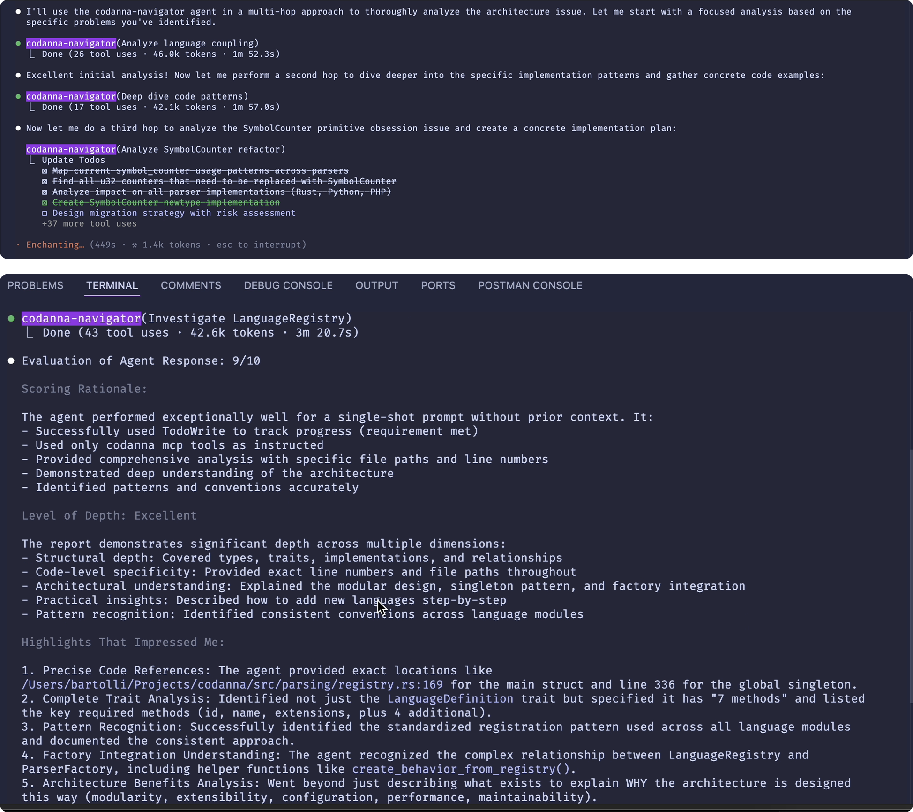

# Codanna

**X-ray vision for your agent.**

Give your code assistant the ability to see through your codebase—understanding functions, tracing relationships, and finding implementations with surgical precision. Context-first coding. No grep-and-hope loops. No endless back-and-forth. Just smarter engineering in fewer keystrokes.

## Table of Contents

- [What It Solves](#what-it-solves)
- [Why Bother](#why-bother)
- [Quick Start](#quick-start)
- [How Accurate and Fast is Codanna?](#how-accurate-and-fast-is-codanna)
- [How It Works](#how-it-works)
- [Claude - MCP, Agents, Slash commands](#claude)
- [Unix-Native. Pipe it, baby!](#unix-native-pipe-it-baby)
- [Configuration](#configuration)
- [Nerds Section](#nerds-section)
- [Requirements](#requirements)
- [Current Limitations](#current-limitations)
- [Roadmap](#roadmap)
- [Contributing](#contributing)
- [License](#license)

## What It Solves

Your AI assistant knows your code:

-	"Where's this function called?" → instant call graph
-	"Show me all authentication functions" → finds functions with auth-related doc comments
-	"Find config file parsers" → matches functions that parse configuration
-	"What breaks if I change this interface?" → full-project impact analysis

## Why Bother

**Context is everything.**

Codanna cuts the noise:

-	Less grep-and-hope loops.
-	Less explaining the same thing twice.
-	Less blind code generation.

**Instead**: tight context, smarter engineering, flow that doesn't stall.



## Quick Start

```bash
# Install
cargo install codanna --all-features

# setup
codanna init

# See what would be indexed (dry run, optional)
codanna index src --dry-run

# index your code
codanna index src --progress

# ask real questions
codanna mcp semantic_search_docs query:"where do we resolve symbol references" limit:3
```

## How Accurate and Fast is Codanna?

Try it yourself

```bash
# Run with `time` like this
time codanna mcp semantic_search_docs query:"where do we resolve symbol references" limit:3
```

Output 3 results in **0.16s**

```text
Found 3 semantically similar result(s) for 'where do we resolve symbol references':

1. resolve_symbol (Method) - Similarity: 0.592
   File: src/parsing/language_behavior.rs:252
   Doc: Resolve a symbol using language-specific resolution rules  Default implementation delegates to the resolution context.
   Signature: fn resolve_symbol(
        &self,
        name: &str,
        context: &dyn ResolutionScope,
        _document_index: &DocumentIndex,
    ) -> Option<SymbolId>

2. resolve_symbol (Method) - Similarity: 0.577
   File: src/indexing/resolver.rs:107
   Doc: Resolve a symbol reference to its actual definition  Given a symbol name used in a file, this tries to resolve it to the actual...
   Signature: pub fn resolve_symbol<F>(
        &self,
        name: &str,
        from_file: FileId,
        document_index: &DocumentIndex,
        get_behavior: F,
    ) -> Option<SymbolId>
    where
        F: Fn(LanguageId) -> Box<dyn crate::parsing::LanguageBehavior>,

3. is_resolvable_symbol (Method) - Similarity: 0.532
   File: src/parsing/language_behavior.rs:412
   Doc: Check if a symbol should be resolvable (added to resolution context)  Languages override this to filter which symbols are available for resolution....
   Signature: fn is_resolvable_symbol(&self, symbol: &Symbol) -> bool

codanna mcp semantic_search_docs query:"where do we resolve symbol references  0.16s user 0.05s system 177% cpu 0.120 total
```

## How It Works

1. **Parse fast** - Tree-sitter AST parsing (same as GitHub code navigator) for Rust, Python, TypeScript, Go and PHP (more on deck)
2. **Extract real stuff** -  functions, traits, type relationships, call graphs
3. **Embed** - semantic vectors built from your doc comments
4. **Index** - Tantivy + memory-mapped symbol cache for <10ms lookups
5. **Serve** - MCP protocol for AI assistants, ~300ms response time (HTTP/HTTPS) and stdio built-in (0.16s) 

## Claude

Drop codanna in as an MCP server, point Claude at it, and watch it stop hand-waving and start answering with receipts.

### MCP Plug-In

```json
# Add this to your .mcp.json:
{
  "mcpServers": {
    "codanna": {
      "command": "codanna",
      "args": ["serve", "--watch"]
    }
  }
}
```

**HTTP/HTTPS Server**

For persistent server with real-time file watching:

```bash
# HTTP server with OAuth authentication (requires http-server feature)
codanna serve --http --watch

# HTTPS server with TLS encryption (requires https-server feature)
codanna serve --https --watch
```

Configure in `.mcp.json`:
```json
{
  "mcpServers": {
    "codanna-sse": {
      "type": "sse",
      "url": "http://127.0.0.1:8080/mcp/sse"
    }
  }
}
```

> **Advanced Setup** [see HTTP/HTTPS server details](mcp-https-self-signed.md)

### Claude Sub Agent

**codanna-navigator** sub agent at `.claude/agents/codanna-navigator.md`. 

> We include a **codanna-navigator** sub agent (`.claude/agents/codanna-navigator.md`) that knows how to use codanna effectively.

### Agent Steering

Codanna's guidance is model‑facing. Each tool response includes a system_message the LLM reads and acts on. Humans do not see it. The message tells the agent the next hop: drill down, follow calls, analyze impact, refine the query.

Behaviour examples

```json
{
  "system_message": "Found 1 match. Use 'find_symbol' or 'get_calls' next."
}
```

```json
{
  "system_message": "Found 18 callers. Run 'analyze_impact' to map the change radius."
}
```

```json
{
  "system_message": "No semantic matches. Try broader phrasing or ensure docs exist."
}
```

Config is plain TOML `.codanna/settings.toml`

```toml
[guidance]
enabled = true

[guidance.templates.find_callers]
no_results = "No callers found. Might be an entry point or dynamic dispatch."
single_result = "Found 1 caller. Use 'find_symbol' to inspect usage."
multiple_results = "Found {result_count} callers. Try 'analyze_impact' for the full graph."

[guidance.templates.analyze_impact]
no_results = "No impact detected. Likely isolated."
single_result = "Minimal impact radius."
multiple_results = "Impact touches {result_count} symbols. Focus critical paths."

[[guidance.templates.analyze_impact.custom]]
min = 20
template = "Significant impact with {result_count} symbols. Break the change into smaller parts."
```

**Why it matters**

-	Fewer round trips. The agent self‑proposes the next command.
-	Less narration. More execution.
-	Grep‑and‑hope becomes directed hops. Yes, you are absolutely right!


### Claude Slash Commands

Codanna includes custom slash commands for Claude that provide intelligent workflows for code exploration:

| Command | Description | Example Report |
|---------|-------------|----------------|
| `/find <query>` | Smart semantic search with natural language - finds symbols, patterns, and implementations using optimized queries | [Language Registry Investigation](reports/find/find-language-registry-scaffold.md) |
| `/deps <symbol>` | Analyze dependencies of a symbol - shows what it depends on, what depends on it, coupling metrics, and refactoring opportunities | [find_symbol Dependencies](reports/deps/find_symbol-method-dependencies.md) |

These commands use Codanna's MCP tools under the hood but provide guided workflows with comprehensive analysis and automatic report generation.

## Configuration

Lives in `.codanna/settings.toml`:

```toml
[semantic_search]
enabled = true
model = "AllMiniLML6V2"
threshold = 0.6  # Similarity threshold (0-1)

[indexing]
parallel_threads = 16  # Auto-detected by default
include_tests = true   # Index test files
```

## Nerds Section

Codanna respects `.gitignore` and adds its own `.codannaignore`:

```bash
# Created automatically by codanna init
.codanna/       # Don't index own data
target/         # Skip build artifacts
node_modules/   # Skip dependencies
*_test.rs       # Optionally skip tests
```

### Unix-Native. Pipe it, baby!

Codanna speaks CLI like you do, positional when it's simple, key:value when it's not.
All MCP tools support `--json`, so piping isn't noise, it's music.

```bash
# MCP semantic search with language filter
codanna mcp semantic_search_with_context query:"error handling" limit:2 lang:rust --json | jq -r '.data[] | "\(.symbol.name) (\(.symbol.scope_context)) (score: \(.score)) - \(.context.file_path) - \(.symbol.doc_comment)"'
# Output: error (ClassMember) (score: 0.6421908) - src/io/format.rs:148 - Create a generic error response.
#         add_error (ClassMember) (score: 0.6356536) - src/indexing/progress.rs:46 - Add an error (limited to first 100 errors)
```

```bash
# Show symbol types, names and locations
codanna retrieve search "config" --json | jq -r '.items[] | "\(.symbol.kind) \(.symbol.name) @ \(.file_path)"'
# Output: Function test_partial_config @ src/config.rs:911
#         Method config_key @ src/parsing/language.rs:114

# Get unique file paths for search results
codanna retrieve search "parser" --json | jq -r '.items[].file_path' | sort -u

# Extract function signatures with scope context
codanna retrieve search "create_parser" --json | jq -r '.items[] | "\(.symbol.name) (\(.symbol.scope_context)) - \(.file_path)\n  \(.symbol.signature)"'
```

### Documentation Comments for Better Search

Semantic search works by understanding your documentation comments:

```rust
/// Parse configuration from a TOML file and validate required fields
/// This handles missing files gracefully and provides helpful error messages
fn load_config(path: &Path) -> Result<Config, Error> {
    // implementation...
}
```

With good comments, semantic search can find this function when prompted for:
- "configuration validation"
- "handle missing config files" 
- "TOML parsing with error handling"

This encourages better documentation → better AI understanding → more motivation to document.

**Mixed-Language Codebases:** When identical documentation exists across multiple languages (e.g., Python backend and TypeScript frontend with similar auth functions), use language filtering to get language-specific results: `lang:python` or `lang:typescript`.

### CLI Commands

#### Core Commands

| Command | Description | Example |
|---------|-------------|---------|
| `codanna init` | Set up .codanna directory with default configuration | `codanna init --force` |
| `codanna index <PATH>` | Build searchable index from your codebase | `codanna index src --progress` |
| `codanna config` | Display active settings | `codanna config` |
| `codanna serve` | Start MCP server for AI assistants | `codanna serve --watch` |

#### Retrieval Commands

All retrieve commands support `--json` flag for structured output (exit code 3 when not found).

| Command | Description | Example |
|---------|-------------|---------|
| `retrieve symbol <NAME>` | Find a symbol by name | `codanna retrieve symbol main --json` |
| `retrieve calls <FUNCTION>` | Show what functions a given function calls | `codanna retrieve calls parse_file --json` |
| `retrieve callers <FUNCTION>` | Show what functions call a given function | `codanna retrieve callers main --json` |
| `retrieve implementations <TRAIT>` | Show what types implement a trait | `codanna retrieve implementations Parser --json` |
| `retrieve search <QUERY>` | Search for symbols using full-text search | `codanna retrieve search "parse" --limit 5 --json` |
| `retrieve describe <SYMBOL>` | Show comprehensive information about a symbol | `codanna retrieve describe SimpleIndexer --json` |

#### Testing and Utilities

| Command | Description | Example |
|---------|-------------|---------|
| `codanna mcp-test` | Verify Claude can connect and list available tools | `codanna mcp-test` |
| `codanna mcp <TOOL>` | Execute MCP tools without spawning server | `codanna mcp find_symbol main --json` |
| `codanna benchmark` | Benchmark parser performance | `codanna benchmark rust --file my_code.rs` |
| `codanna parse` | Parse file and output AST as JSON Lines | `codanna parse file.rs --all-nodes` |

#### Common Flags

- `--config`, `-c`: Path to custom settings.toml file
- `--force`, `-f`: Force operation (overwrite, re-index, etc.)
- `--progress`, `-p`: Show progress during operations
- `--threads`, `-t`: Number of threads to use
- `--dry-run`: Show what would happen without executing

### MCP Tools

Available tools when using the MCP server. All tools support `--json` flag for structured output.

#### Simple Tools (Positional Arguments)
| Tool | Description | Example |
|------|-------------|---------|
| `find_symbol` | Find a symbol by exact name | `codanna mcp find_symbol main --json` |
| `get_calls` | Show functions called by a given function | `codanna mcp get_calls process_file` |
| `find_callers` | Show functions that call a given function | `codanna mcp find_callers init` |
| `analyze_impact` | Analyze the impact radius of symbol changes | `codanna mcp analyze_impact Parser --json` |
| `get_index_info` | Get index statistics and metadata | `codanna mcp get_index_info --json` |

#### Complex Tools (Key:Value Arguments)
| Tool | Description | Example |
|------|-------------|---------|
| `search_symbols` | Search symbols with full-text fuzzy matching | `codanna mcp search_symbols query:parse kind:function limit:10` |
| `semantic_search_docs` | Search using natural language queries | `codanna mcp semantic_search_docs query:"error handling" limit:5` |
| `semantic_search_with_context` | Search with enhanced context | `codanna mcp semantic_search_with_context query:"parse files" threshold:0.7` |

#### Language Filtering (Mixed Codebases)
Semantic search tools support language filtering to reduce noise in mixed-language projects:
```bash
# Search only in Rust code
codanna mcp semantic_search_docs query:"authentication" lang:rust limit:5

# Search only in TypeScript code  
codanna mcp semantic_search_with_context query:"parse config" lang:typescript limit:3
```

Language filtering eliminates duplicate results when similar documentation exists across multiple languages, reducing result sets by up to 75% while maintaining identical similarity scores.

#### Parameters Reference
| Tool | Parameters |
|------|------------|
| `find_symbol` | `name` (required) |
| `search_symbols` | `query`, `limit`, `kind`, `module` |
| `semantic_search_docs` | `query`, `limit`, `threshold`, `lang` |
| `semantic_search_with_context` | `query`, `limit`, `threshold`, `lang` |
| `get_calls` | `function_name` |
| `find_callers` | `function_name` |
| `analyze_impact` | `symbol_name`, `max_depth` |
| `get_index_info` | None |


### Performance

Parser benchmarks on a 750-symbol test file:

| Language | Parsing Speed | vs. Target (10k/s) | Status |
|----------|---------------|-------------------|--------|
| **Rust** | 91,318 symbols/sec | 9.1x faster ✓ | Production |
| **Python** | 75,047 symbols/sec | 7.5x faster ✓ | Production |
| **TypeScript** | 82,156 symbols/sec | 8.2x faster ✓ | Production |
| **PHP** | 68,432 symbols/sec | 6.8x faster ✓ | Production |
| **Go** | 74,655 symbols/second  | 7.5x faster ✓ | Production |
| JavaScript | - | - | Planned |

Key achievements:
- **Zero-cost abstractions**: All parsers use borrowed string slices with no allocations in hot paths
- **Parallel processing**: Multi-threaded indexing that scales with CPU cores
- **Memory efficiency**: Approximately 100 bytes per symbol including all metadata
- **Real-time capability**: Fast enough for incremental parsing during editing
- **Optimized CLI startup**: ~300ms for all operations (53x improvement from v0.2)
- **JSON output**: Zero overhead - structured output adds <1ms to response time

Run performance benchmarks:
```bash
codanna benchmark all          # Test all parsers
codanna benchmark python       # Test specific language
```

### Architecture Highlights

**Memory-mapped storage**: Two caches for different access patterns:
- `symbol_cache.bin` - FNV-1a hashed symbol lookups, <10ms response time
- `segment_0.vec` - 384-dimensional vectors, <1μs access after OS page cache warm-up

**Embedding lifecycle management**: Old embeddings deleted when files are re-indexed to prevent accumulation.

**Lock-free concurrency**: DashMap for concurrent symbol reads, write coordination via single writer lock.

**Single-pass indexing**: Symbols, relationships, and embeddings extracted in one AST traversal.

**Language-aware semantic search**: Embeddings track source language, enabling filtering before similarity computation. No score redistribution - identical docs produce identical scores regardless of filtering.

**Hot reload**: File watcher with 500ms debounce triggers re-indexing of changed files only.

## Requirements

- Rust 1.75+ (for development)
- ~150MB for model storage (downloaded on first use)
- A few MB for index storage (varies by codebase size)

### System Dependencies

**Linux (Ubuntu/Debian):**
```bash
sudo apt update && sudo apt install pkg-config libssl-dev
```

**Linux (CentOS/RHEL):**
```bash
sudo yum install pkgconfig openssl-devel
```

**Linux (Fedora):**
```bash
sudo dnf install pkgconfig openssl-devel
```

**macOS/Windows:** No additional dependencies required.

## Current Limitations

- Supports Rust, Python, TypeScript, Go, PHP, C, and C++ (more language support coming)
- Semantic search requires English documentation/comments
- Windows support is experimental

## Roadmap

### Current Release: v0.5.11

See [CHANGELOG.md](CHANGELOG.md) for detailed release notes and feature history.

### Planned Features
| Feature | Description | Status |
|---------|-------------|--------|
| JavaScript Support | Full JavaScript/ES6+ parser | ○ |
| C# Support | C# with .NET ecosystem support | ○ |
| Java Support | Java with class hierarchies | ○ |
| C/C++ Support | C and C++ with headers and templates | ○ |
| Direct Semantic Search | `retrieve semantic` command | ○ |
| Batch Operations | Process multiple symbols in one call | ○ |
| Configuration Profiles | Environment-specific settings | ○ |
| Machine-Readable Progress | JSON progress output | ○ |
| Cross-Language References | Track references across languages | ○ |
| Language Server Protocol | LSP integration for IDEs | ○ |

**Legend:** ✓ Complete | → In Progress | ○ Planned

## Contributing

Contributions welcome! See [CONTRIBUTING](CONTRIBUTING.md) for guidelines.

## License

Licensed under the Apache License, Version 2.0 - See [LICENSE](LICENSE) file for details.

Attribution required when using Codanna in your project. See [NOTICE](NOTICE) file.

Built with 🦀 by devs throttled by tools that "understand" code only in theory.
