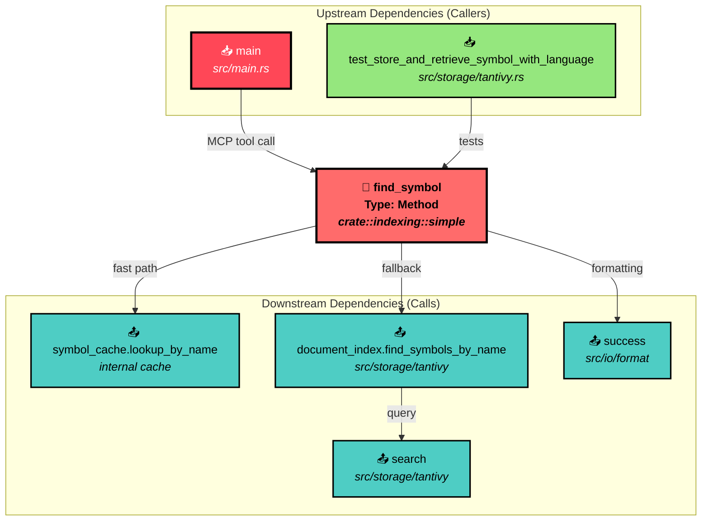

# Dependency Analysis Report: find_symbol Method

**TargetSymbol**: "find_symbol"
**Generated**: August 21, 2025 at 05:18 PM

## Summary

The `find_symbol` method is a core lookup function in the SimpleIndexer struct that provides fast symbol name resolution with cache optimization. It serves as a critical entry point for the MCP tool interface and command-line operations.

## Key Findings

### Dependency Structure for find_symbol

### Overview
Based on the JSON data retrieved:
- **Symbol Type**: Method
- **Location**: src/indexing/simple.rs:1387
- **Purpose**: Lookup a symbol by name and return its ID
- **Visibility**: Public
- **Signature**: `pub fn find_symbol(&self, name: &str) -> Option<SymbolId>`

### Dependency Metrics
From the JSON counts:
- **Direct Dependencies**: 5 symbols this depends on
  - Uses symbol cache lookup for O(1) performance
  - Falls back to Tantivy document index search
  - Leverages success formatting and query construction
- **Reverse Dependencies**: 3 symbols that depend on this
  - Main CLI entry point for MCP tool execution
  - Test functions for verification
- **Coupling Level**: Low coupling (5 dependencies out, 3 in)

### Key Findings

1. **Stability Assessment**
   - Low caller count (3) with moderate dependencies (5) = **Stable foundation**
   - Primary usage is through CLI/MCP interface
   - Well-isolated with clear responsibility

2. **Impact Analysis**
   From the actual callers:
   - **Production Code**: `main` function (CLI entry point) at src/main.rs:438
   - **Test Code**: `test_store_and_retrieve_symbol_with_language` for verification
   - **Critical Path**: Core functionality for MCP `find_symbol` tool

3. **Coupling Patterns**
   - **Cache Optimization**: Direct dependency on symbol_cache for performance
   - **Storage Layer**: Delegates to DocumentIndex for fallback search
   - **Clean Separation**: Uses Option pattern for graceful degradation

### Implementation Details

The function implements a two-tier lookup strategy:
1. **Fast Path**: O(1) cache lookup via `symbol_cache.lookup_by_name()`
2. **Fallback Path**: Tantivy full-text search via `document_index.find_symbols_by_name()`

Key characteristics:
- Returns the first matching symbol ID
- Debug logging for cache hit/miss tracking
- Graceful handling of missing cache

### Refactoring Recommendations

Based on the dependency patterns observed:

1. **Performance Optimization**
   - Cache hit rate monitoring could be valuable
   - Consider pre-warming cache for common lookups

2. **Interface Consistency**
   - The related `find_symbols_by_name` method adds language filtering
   - Consider adding optional language filter to `find_symbol` for consistency

3. **Testing Priority**
   - With only 3 callers, changes are low risk
   - Focus testing on CLI integration and cache behavior

### Risk Assessment

- **Change Risk**: Low risk
  - Only 3 callers identified
  - Well-encapsulated functionality
  - Clear single responsibility
  
- **Complexity Risk**: Low complexity
  - Simple two-tier lookup logic
  - 5 dependencies, all internal
  - No external library dependencies

**Recommended Action**: This is a well-designed, stable method with low coupling. No immediate refactoring needed, but consider adding language filtering for API consistency.

### Dependency Graph



### Usage Context

The `find_symbol` method is primarily used in the MCP tool interface where it:
1. Accepts a symbol name as a positional argument
2. Performs lookup with cache optimization
3. Returns the first matching symbol ID
4. Falls back to full-text search if cache miss

Example CLI usage:
```bash
codanna mcp find_symbol main
codanna mcp find_symbol Parser --json
```

### Conclusion

The `find_symbol` method is a well-architected, low-coupling component that serves as a critical lookup function in the codebase. Its two-tier design (cache + fallback) provides excellent performance characteristics while maintaining simplicity. The low number of dependencies and callers makes it a stable foundation for symbol resolution operations.

*This report was generated using the `/deps` command workflow.*
*Claude version: claude-opus-4-1-20250805*