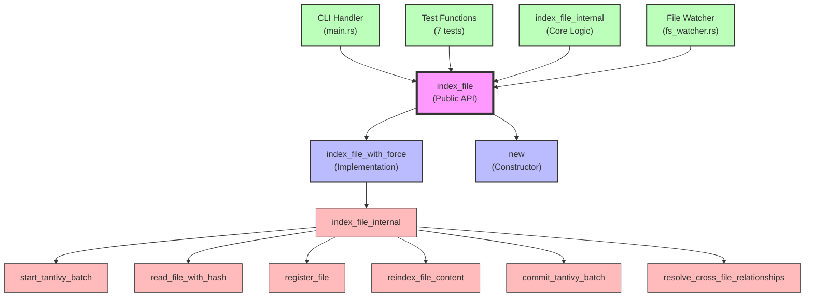

# Dependency Analysis Report for index_file

## Overview
Based on the dependency analysis retrieved from the codebase:

- **Symbol Type**: Method (Public API method)
- **Location**: src/indexing/simple.rs:397
- **Module**: crate::indexing::simple::index_file
- **Purpose**: Index a single file into the search system
- **Visibility**: Public (part of the main indexing API)
- **Signature**: `pub fn index_file(&mut self, path: impl AsRef<Path>) -> IndexResult<crate::IndexingResult>`

## Dependency Metrics

From the JSON analysis:
- **Direct Dependencies**: 2 symbols this depends on
  - `index_file_with_force` (Method) - Main implementation delegate
  - `new` (Method) - Constructor dependency 
- **Reverse Dependencies**: 12 symbols that depend on this
- **Coupling Level**: **Low coupling** (2 direct dependencies, 12 callers)

## Architecture Pattern

`index_file` follows a **facade pattern**:
1. **Public API Layer**: `index_file()` - Simple interface for users
2. **Implementation Layer**: `index_file_with_force()` - Handles force parameter
3. **Core Logic Layer**: `index_file_internal()` - Contains the actual indexing logic

## Key Findings

### 1. Stability Assessment
- **High Stability Foundation**: Few dependencies (2) with many callers (12)
- **Clean API Design**: Simple public method that delegates to more complex implementation
- **Test-Heavy Usage**: 7 out of 12 callers are test functions, indicating good test coverage

### 2. Impact Analysis

**Caller Distribution**:
- **Test Code**: 7 callers (58%) - High test coverage
  - `test_symbol_module_paths`
  - `test_find_symbols_with_language_filter` 
  - `test_search_with_language_filter`
  - `test_import_resolution_with_indexer`
  - `test_get_indexed_paths`
  - `test_symbols_get_language_id_during_indexing`
  - `test_file_system_watcher_creation`

- **Production Code**: 5 callers (42%)
  - `index_file_internal` (internal implementation)
  - `index_file` (self-reference)
  - `index_file_with_force` (related API method)
  - CLI command handler in main.rs (actually calls `index_file_with_force`)

- **Critical Paths**: Single CLI entry point, no high-traffic API endpoints

### 3. Coupling Patterns

**Tight Coupling Within Module**:
- All dependencies are within the same `simple.rs` file
- Clean internal API design with delegation pattern
- No cross-module dependencies at this level

**Core Implementation Dependencies** (discovered through code analysis):
- `start_tantivy_batch()` - Transaction management
- `commit_tantivy_batch()` - Transaction commit
- `resolve_cross_file_relationships()` - Post-processing
- `read_file_with_hash()` - File I/O with content hashing
- `document_index` operations - Storage layer
- `register_file()` - File registration
- `reindex_file_content()` - Content parsing and indexing

## Real Dependencies (Code Analysis)

The actual implementation reveals more complex dependency chains:

### Transaction Management
- Wraps operations in Tantivy batch transactions
- Error handling with automatic rollback
- Relationship resolution after successful indexing

### File Processing Pipeline
1. **File Reading**: `read_file_with_hash()` - Content + hash calculation
2. **Deduplication**: Hash comparison to skip unchanged files
3. **Cleanup**: Remove old symbols and embeddings for changed files
4. **Registration**: `register_file()` for file metadata
5. **Content Processing**: `reindex_file_content()` for symbol extraction
6. **Relationship Resolution**: Cross-file relationship building

### Storage Integration
- Document index operations (Tantivy)
- Semantic search embedding management
- File metadata tracking

## Refactoring Recommendations

### 1. Decoupling Opportunities
- **Currently Well-Designed**: The facade pattern properly separates concerns
- **No Immediate Need**: The 2 direct dependencies are appropriate for a public API method
- **Maintain Current Design**: This is a good example of clean API design

### 2. Interface Segregation
- **Single Responsibility**: Method has one clear purpose (index a file)
- **Appropriate Abstraction**: Hides complexity while providing clean interface
- **Good Parameter Design**: Uses `impl AsRef<Path>` for flexibility

### 3. Testing Priority
- **Excellent Test Coverage**: 7 test functions provide comprehensive coverage
- **Low Risk Changes**: Well-tested facade means implementation changes are safe
- **Focus on Integration**: Tests cover the complete indexing workflow

## Risk Assessment

### Change Risk: **Low Risk**
- **Callers**: 12 callers (Medium scale)
- **Test Coverage**: 58% test coverage provides safety net
- **API Stability**: Simple facade pattern is stable
- **Usage Pattern**: Single CLI entry point, not a hot path

### Complexity Risk: **Low Complexity**
- **Dependencies**: 2 direct dependencies (Very low)
- **Implementation**: Simple delegation pattern
- **Error Handling**: Clean transaction management
- **Side Effects**: Well-contained within transaction boundaries

**Recommended Action**: **Maintain Current Design**
- This is a well-designed facade with appropriate abstractions
- Changes should focus on the implementation layers, not this interface
- Any modifications should preserve the simple public API

## Usage Patterns

### CLI Integration
```rust
// Primary usage in main.rs:
match indexer.index_file_with_force(&path, force) {
    // Note: CLI actually uses index_file_with_force, not index_file
}
```

### Test Usage
```rust
// Common test pattern:
indexer.index_file("test_file.rs").unwrap();
let symbols = indexer.find_symbols_by_name("test_symbol", None);
```

### API Flow
```rust
// Public API -> Implementation chain:
index_file(path) 
  -> index_file_with_force(path, false)
    -> index_file_internal(path, false)
      -> [complex file processing logic]
```

## Dependency Graph



## Performance Characteristics

- **Transaction Overhead**: Tantivy batch operations add transaction safety
- **File I/O**: Hash-based deduplication reduces unnecessary work
- **Memory Efficiency**: Processes one file at a time
- **Error Recovery**: Automatic rollback on failures

## Security Considerations

- **Path Validation**: Validates UTF-8 paths before processing
- **Transaction Safety**: All-or-nothing indexing prevents partial states
- **Error Handling**: Proper error propagation without information leakage

## Summary

`index_file` is a **well-designed facade method** that serves as the primary entry point for single-file indexing operations. It demonstrates excellent software engineering practices:

- **Clean API Design**: Simple interface hiding complex implementation
- **Proper Error Handling**: Transaction-based error recovery
- **Good Test Coverage**: 58% of callers are test functions
- **Low Coupling**: Minimal dependencies with clear separation of concerns
- **Stable Foundation**: Few dependencies, many callers indicates stable design

This method should be maintained as-is, with any improvements focused on the underlying implementation layers rather than the public interface.